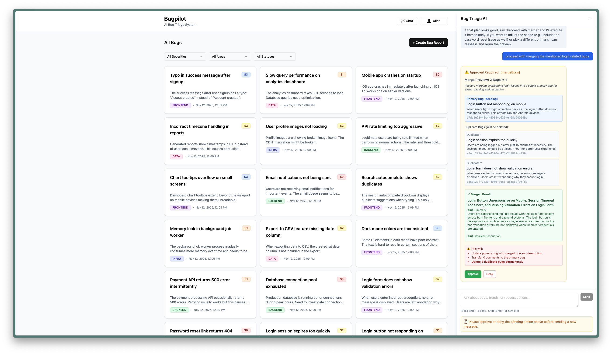

# Bugpilot - AI Bug Triage Board

> An intelligent bug tracking system with AI-powered triage, duplicate detection, and conversational analysis.

<p align="center">
  
</p>

---

## 🚀 Quick Start

Run the automated setup script to get started in seconds:

```bash
./setup.sh
```

This handles everything: dependencies, environment setup, database, and sample data.

> **Manual Setup**: See [Manual Setup](#manual-setup) if you prefer step-by-step installation.

---

## ✨ Features

<table>
<tr>
<td width="50%">

### 🤖 AI-Powered
- **Smart Classification**: Automatic severity and area suggestions
- **Duplicate Detection**: Semantic similarity with pgvector
- **Conversational Agent**: Natural language bug analysis

</td>
<td width="50%">

### 🛠️ Bug Management
- **Full CRUD**: Create, read, update, delete bugs
- **Comments & Threads**: Collaborate on bug resolutions
- **Status Tracking**: Filter and organize your bugs

</td>
</tr>
</table>

---

## 🤖 AI Chat Assistant & Tools

The AI agent can help you manage bugs through natural conversation. It has access to **6 powerful tools**:

| Tool | Description | Example Use |
|------|-------------|-------------|
| 🔍 `queryBugs` | Search bugs by severity, area, status, or keywords | "Show me all critical authentication bugs" |
| 📊 `analyzeTrends` | Identify patterns and trends across the bug database | "What are the most common bug areas?" |
| 🔎 `getBugDetails` | Get detailed info including comments and similar bugs | "Tell me more about bug #123" |
| ✏️ `updateBugs` | Bulk update bug metadata (severity, area, status) | "Mark all payment bugs as high priority" |
| 👀 `generateMergePreview` | Preview how duplicate bugs will be merged | "Show me how these login bugs would merge" |
| 🔀 `mergeBugs` | Merge duplicate bugs into a primary bug (requires approval) | "Merge these duplicate password reset issues" |

### 💬 Try These Prompts

```
"What are the critical bugs in the authentication area?"
"Show me trends in recent bug reports"
"Find and merge all duplicate login issues"
"Which areas have the most bugs this week?"
```

---

## 🏗️ Tech Stack

**Frontend**: React 18 • TypeScript • Vite • TailwindCSS • tRPC  
**Backend**: Node.js • Fastify • tRPC • Prisma • PostgreSQL • pgvector  
**AI**: OpenAI (embeddings + chat) • Vercel AI SDK 6.0

---

## ⚡ Essential Commands

```bash
./setup.sh           # 🚀 Complete automated setup (cold start)
pnpm dev             # 🔥 Start frontend + backend (both)
pnpm dev:backend     # 🔧 Start backend only
pnpm dev:frontend    # 💻 Start frontend only
pnpm db:studio       # 📊 Open database GUI
docker-compose logs  # 📝 View database logs
```

---

## 🔧 Manual Setup

**Prerequisites**: Node.js 20+, pnpm 8+, Docker, OpenAI API key

```bash
# 1️⃣ Install dependencies
pnpm install

# 2️⃣ Setup environment
cp .env.example .env
# Edit .env and add your OPENAI_API_KEY

# 3️⃣ Start database
docker-compose up -d

# 4️⃣ Setup database schema
pnpm db:generate
pnpm db:migrate

# 5️⃣ Seed sample data (optional)
pnpm db:seed

# 6️⃣ Start dev servers
pnpm dev
```

🌐 **Visit** [http://localhost:5173](http://localhost:5173) for the frontend.

---

## 📁 Project Structure

This is a **pnpm monorepo** with three main packages:

```
bugpilot/
├── apps/
│   ├── backend/                    # Backend API server
│   │   ├── src/
│   │   │   ├── routers/            # tRPC route handlers
│   │   │   │   ├── bug.ts          # Bug CRUD operations
│   │   │   │   ├── chat.ts         # AI chat streaming endpoint
│   │   │   │   ├── comment.ts      # Comment operations
│   │   │   │   └── user.ts         # User management
│   │   │   ├── services/llm/       # AI/LLM services
│   │   │   │   ├── bug-triage-agent.ts    # Main chat agent
│   │   │   │   ├── classification-service.ts  # Severity/area classification
│   │   │   │   ├── embedding-service.ts   # Vector embeddings
│   │   │   │   └── tools/          # Agent tools (query, merge, analyze, etc.)
│   │   │   ├── middleware/         # Error handling
│   │   │   ├── db/                 # Prisma client setup
│   │   │   ├── trpc.ts             # tRPC configuration
│   │   │   └── server.ts           # Fastify server setup
│   │   └── prisma/
│   │       ├── schema.prisma       # Database schema
│   │       └── migrations/         # Database migrations
│   │
│   └── frontend/                   # React frontend application
│       ├── src/
│       │   ├── components/
│       │   │   ├── bugs/           # Bug-related UI (list, detail, forms, comments)
│       │   │   ├── chat/           # Chat interface (messages, approvals, tool UI)
│       │   │   └── ui/             # Reusable shadcn/ui components
│       │   ├── pages/              # Route pages (dashboard, bug detail)
│       │   ├── hooks/              # React hooks (bug data, forms, auto-scroll)
│       │   ├── lib/                # Utilities (tRPC client, store, context)
│       │   └── types/              # TypeScript types
│       └── vite.config.ts          # Vite configuration
│
├── packages/
│   └── shared/                     # Shared code between apps
│       └── src/
│           └── schemas.ts          # Zod schemas for validation
│
├── docker-compose.yml              # PostgreSQL + pgvector database
├── setup.sh                        # Automated setup script
└── pnpm-workspace.yaml             # Monorepo workspace config
```

**Key Architecture Points:**
- **Backend**: Fastify server with tRPC for type-safe APIs. AI services handle embeddings, classification, and the chat agent with tool-based capabilities.
- **Frontend**: React SPA with tRPC React Query for type-safe API calls. Organized by feature (bugs, chat) with shared UI components.
- **Shared**: Common Zod schemas and types used by both apps for consistency.
- **Database**: PostgreSQL with pgvector extension for semantic similarity search.

---

## 🔍 Troubleshooting

| Issue | Solution |
|-------|----------|
| **Prisma errors** | Run `pnpm db:generate` from project root |
| **Database issues** | Check `docker-compose ps` and verify `.env` is in root |
| **Seed fails** | Verify `OPENAI_API_KEY` in `.env` |
| **Port already in use** | Kill existing processes or change ports in `.env` |

---
